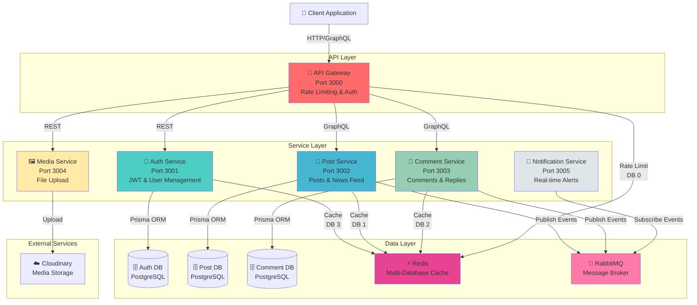
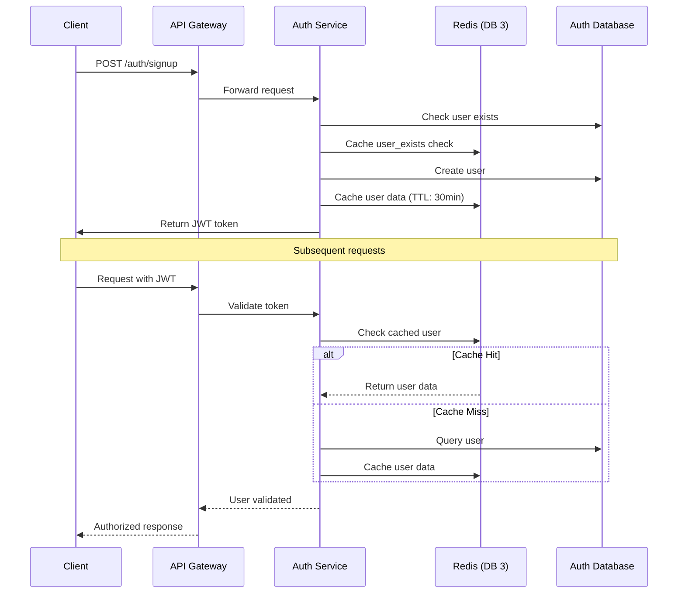
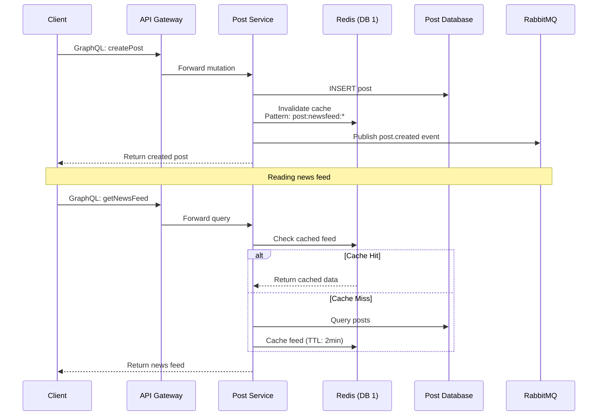
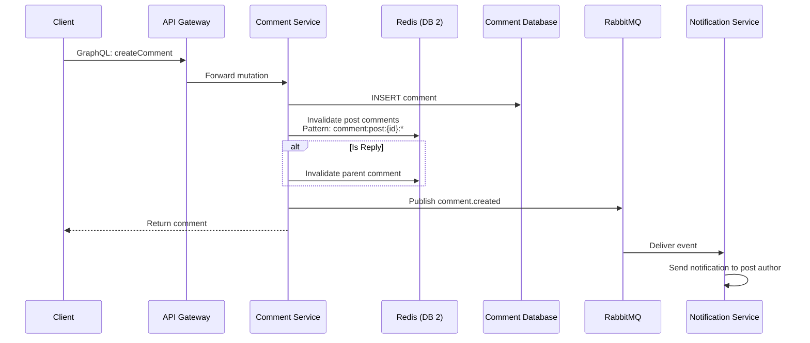
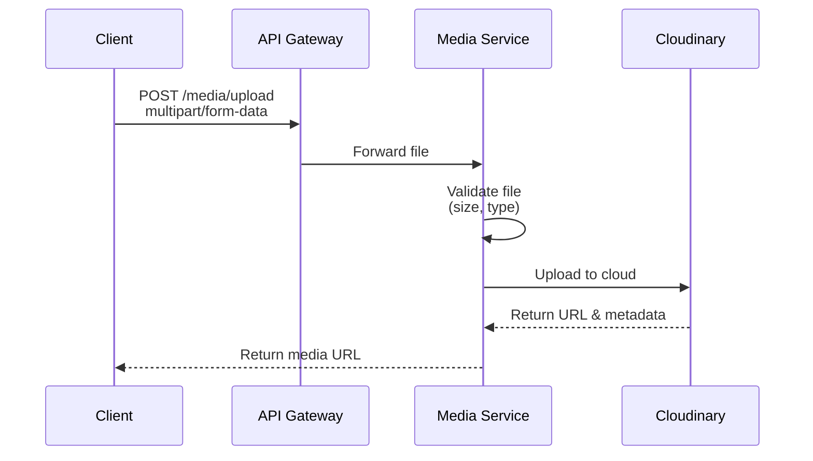
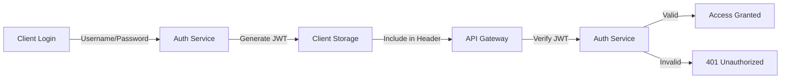
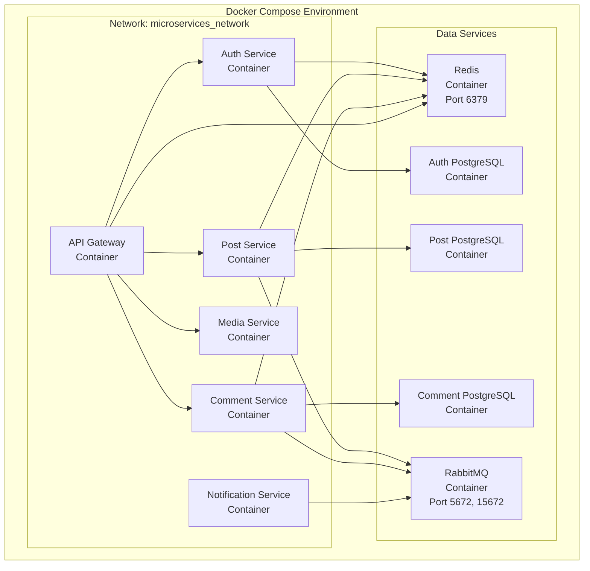

# 🏗️ Kiến Trúc Hệ Thống Microservices

## 📊 Tổng Quan Kiến Trúc

Hệ thống được xây dựng theo mô hình **Microservices Architecture** với Event-Driven Communication và Distributed Caching.



## 🔄 Flow Hoạt Động Chi Tiết

### 1️⃣ User Authentication Flow



### 2️⃣ Post Creation & Caching Flow



### 3️⃣ Comment Creation & Event Flow



### 4️⃣ Media Upload Flow



## 🗄️ Redis Database Allocation

| Database | Service | Purpose | Key Pattern | TTL |
|----------|---------|---------|-------------|-----|
| **DB 0** | API Gateway | Rate Limiting | `ratelimit:{ip}` | 60s |
| **DB 1** | Post Service | Post & Feed Cache | `post:newsfeed:*`<br/>`post:single:{id}` | 2-10min |
| **DB 2** | Comment Service | Comment Cache | `comment:post:{id}:*`<br/>`comment:single:{id}` | 2-10min |
| **DB 3** | Auth Service | User Cache | `auth:user:{id}`<br/>`auth:user_exists:*` | 5-30min |

## 🐰 RabbitMQ Event Patterns

### Published Events

| Service | Event Type | Payload | Subscribers |
|---------|------------|---------|-------------|
| **Post Service** | `post.created` | `{post, userId}` | Notification Service |
| **Comment Service** | `comment.created` | `{comment, postId, postAuthorId}` | Notification Service |

### Event Flow
```
Publisher → Exchange (topic) → Queue → Consumer
```

## 🔐 Authentication & Authorization

### JWT Flow


### Middleware Chain
```
Request → Rate Limiter → JWT Validator → Service Handler
```

## 📦 Data Models

### User (Auth Service)
```prisma
model User {
  id        Int      @id @default(autoincrement())
  username  String   @unique
  email     String   @unique
  password  String
  name      String?
  createdAt DateTime @default(now())
  updatedAt DateTime @updatedAt
}
```

### Post (Post Service)
```prisma
model Post {
  id        Int      @id @default(autoincrement())
  content   String
  imageUrl  String?
  userId    Int
  createdAt DateTime @default(now())
  updatedAt DateTime @updatedAt
}
```

### Comment (Comment Service)
```prisma
model Comment {
  id              Int       @id @default(autoincrement())
  content         String
  postId          Int
  userId          Int
  parentCommentId Int?
  createdAt       DateTime  @default(now())
  updatedAt       DateTime  @updatedAt
  
  replies         Comment[] @relation("CommentReplies")
  parent          Comment?  @relation("CommentReplies")
}
```

## 🚀 Deployment Architecture



## 🛡️ Security Layers

1. **API Gateway Level**
   - Rate Limiting (60 requests/min per IP)
   - JWT Validation
   - Request/Response logging

2. **Service Level**
   - JWT verification
   - Input validation
   - Error handling

3. **Database Level**
   - Connection pooling
   - Prepared statements (SQL injection prevention)
   - ORM validation (Prisma)

## 📈 Scalability Strategy

### Horizontal Scaling
- Each service can be scaled independently
- Stateless design (JWT, no sessions)
- Shared Redis for distributed caching

### Caching Strategy
- **Cache-Aside Pattern**: Check cache → Miss → DB → Update cache
- **TTL-based Expiration**: Auto-cleanup of stale data
- **Event-driven Invalidation**: Real-time cache updates

### Database Optimization
- Indexed fields: `userId`, `postId`, `createdAt`
- Connection pooling: 5 connections per service
- Read replicas (future enhancement)

## 🔧 Technology Stack

| Layer | Technology | Version |
|-------|-----------|---------|
| **Runtime** | Node.js | 20.x |
| **API Gateway** | Express.js | 4.x |
| **GraphQL** | Apollo Server | 4.x |
| **Database** | PostgreSQL | 16.x |
| **Cache** | Redis | 7.x |
| **Message Broker** | RabbitMQ | 3.x |
| **ORM** | Prisma | 5.x |
| **Authentication** | JWT | jsonwebtoken |
| **Cloud Storage** | Cloudinary | - |
| **Containerization** | Docker | 24.x |

## 📝 Service Ports

| Service | Port | Protocol |
|---------|------|----------|
| API Gateway | 3000 | HTTP/REST |
| Auth Service | 3001 | HTTP/REST |
| Post Service | 3002 | HTTP/GraphQL |
| Comment Service | 3003 | HTTP/GraphQL |
| Media Service | 3004 | HTTP/REST |
| Notification Service | 3005 | HTTP/SSE |
| Redis | 6379 | Redis Protocol |
| RabbitMQ | 5672 | AMQP |
| RabbitMQ Management | 15672 | HTTP |

## 🎯 Design Patterns

1. **API Gateway Pattern**: Single entry point for all clients
2. **Database per Service**: Each service owns its data
3. **Event-Driven Architecture**: Async communication via RabbitMQ
4. **Cache-Aside Pattern**: Lazy loading with TTL
5. **Circuit Breaker**: Graceful degradation (future)
6. **Service Discovery**: Static configuration (Docker network)

## 🔄 Data Consistency

### Eventual Consistency
- Event publishing is asynchronous
- Cache invalidation may have slight delay
- Trade-off: Performance vs Immediate Consistency

### Cache Invalidation Strategies
```javascript
// Pattern-based invalidation
await redis.delPattern('comment:post:123:*');

// Single key invalidation
await redis.del('auth:user:456');

// Scan-based safe deletion (production)
const stream = redis.scanStream({
  match: 'comment:post:123:comments:*'
});
```

## 📚 Further Reading

- [Getting Started Guide](GETTING_STARTED.md)
- [API Documentation](API_DOCUMENTATION.md)
- [Deployment Guide](DEPLOYMENT.md)
- [Quick Start (Vietnamese)](QUICK_START_VI.md)
