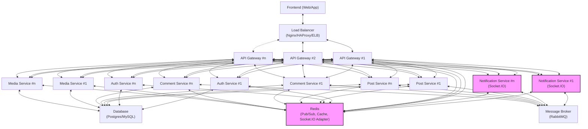

# Hệ thống Microservices - Kiến trúc khi Scale Out

## Sơ đồ kiến trúc chi tiết (Mermaid)



### Ghi chú:
- **Load Balancer**: Phân phối traffic, cần sticky session cho WebSocket hoặc dùng Redis adapter.
- **API Gateway**: Có thể scale out nhiều instance, stateless.
- **Notification Service**: Dùng Socket.IO, scale out cần Redis adapter để đồng bộ kết nối WebSocket.
- **Redis**: Dùng cho cache, pub/sub, đồng bộ Socket.IO.
- **Message Broker**: RabbitMQ dùng cho event-driven giữa các service.
- **Database**: Dùng chung cho các service (có thể tách DB riêng nếu cần).

Sơ đồ này thể hiện rõ các thành phần, các luồng kết nối, và giải pháp đồng bộ WebSocket khi scale out.
# 🏗️ NewFeed Microservices Architecture

A social media platform built with microservices architecture using Node.js, Express, GraphQL, Prisma, Redis, RabbitMQ, and Docker.

[](https://nodejs.org/)
[](https://expressjs.com/)
[](https://www.apollographql.com/)
[](https://www.docker.com/)

---

## 📋 Overview

NewFeed is a complete social media platform with microservices architecture:

**Key Features:**
- ✅ **Authentication** - JWT with httpOnly cookies
- ✅ **Posts** - CRUD with GraphQL, cursor pagination
- ✅ **Comments** - CRUD with GraphQL
- ✅ **Media Upload** - Cloudinary with image optimization
- ✅ **Notifications** - Real-time with Socket.IO, RabbitMQ events
- ✅ **Event-Driven** - RabbitMQ for async communication
- ✅ **Database per Service** - Separate PostgreSQL for each service
- ✅ **API Gateway** - Single entry point with rate limiting

---

## 🏗️ Architecture

```
┌─────────────┐
│   Client    │ (Web / Mobile)
└──────┬──────┘
       │  HTTP / GraphQL / WebSocket
       ▼
┌──────────────────────────────────────────────────────┐
│                 API Gateway :8080                   │
│  - JWT auth (via Auth Service)                      │
│  - Redis rate limiting                              │
│  - Compression & circuit breaker                    │
│  - Proxy:                                           │
│      /api/auth           → Auth Service             │
│      /graphql            → Post / Comment Service   │
│      /api/media          → Media Service            │
│      /notifications/socket.io → Notification Service│
└─────────┬───────────────────────────────────────────┘
          │
   ┌──────┴───────────────┬──────────────┬───────────────┐
   ▼                      ▼              ▼               ▼
┌─────────┐          ┌─────────┐    ┌─────────┐     ┌─────────┐
│  Auth   │          │  Post   │    │ Comment │     │  Media  │
│ Service │          │ Service │    │ Service │     │ Service │
│  :3001  │          │  :3002  │    │  :3004  │     │  :3003  │
└────┬────┘          └────┬────┘    └────┬────┘     └────┬────┘
     │                    │             │               │
     ▼                    ▼             ▼               ▼
[PostgreSQL]        [PostgreSQL]  [PostgreSQL]      [Cloudinary]
  auth_db             post_db      comment_db        media_cdn

                 ┌────────────────────────────────────────────┐
                 │            Notification Service            │
                 │                :3005 (Socket.IO)           │
                 └──────┬─────────────────────────────────────┘
                        │
                        ▼
                   [RabbitMQ]  ◄── Events from Post & Comment
                        │
                        ▼
                 Real-time notifications
                 pushed to connected clients

┌────────────────────────────────────────────────────────────┐
│                        Redis :6379                        │
│  - DB 0: API Gateway rate limiting                        │
│  - DB 1: Post cache (feeds, single posts)                 │
│  - DB 2: Comment cache & GraphQL subscriptions (Pub/Sub)  │
│  - DB 3: Auth cache (user data)                           │
└────────────────────────────────────────────────────────────┘
```

---

## 📂 Project Structure

```
microservices/
├── api-gateway/              # API Gateway (Port 8080)
│   ├── src/
│   │   ├── app.js           # Main Express server
│   │   └── middleware/       # Auth & rate limiting
│   ├── Dockerfile
│   └── package.json
│
├── auth-service/             # Authentication (Port 3001)
│   ├── src/
│   │   ├── app.js
│   │   ├── controllers/      # Auth logic
│   │   └── routes/
│   ├── prisma/schema.prisma
│   └── Dockerfile
│
├── post-service/             # Posts & News Feed (Port 3002)
│   ├── src/
│   │   ├── app.js
│   │   ├── graphql/          # Schema & resolvers
│   │   └── services/         # Event publisher
│   ├── prisma/schema.prisma
│   └── Dockerfile
│
├── comment-service/          # Comments & SSE (Port 3004)
│   ├── src/(Port 3004)
│   ├── src/
│   │   ├── app.js
│   │   ├── graphql/
│   │   ├── routes/
│   │   └── services/         # Event listener & publishera
│   └── Dockerfile
│
├── media-service/            # Media Upload (Port 3003)
│   ├── src/
│   │   ├── app.js
│   │   ├── routes/
│   │   ├── services/         # Cloudinary
│   │   └── config/
│   ├── prisma/schema.prisma
│   └── Dockerfile
│
├── notification-service/     # Real-time Notifications (Port 3005)
│   ├── src/
│   │   ├── app.js           # Socket.IO server
│   │   └── services/
│   │       └── eventListener.js  # RabbitMQ consumer
│   ├── Dockerfile
│   └── package.json
│
├── shared/                   # Shared utilities
│   ├── middleware/
│   │   └── serviceAuth.js    # Service-to-service auth
│   ├── utils/
│   │   └── logger.js         # Winston logger
│   └── index.js
│
├── docker-compose.yml        # Production orchestration
├── install-all.sh/bat        # Install dependencies
├── migrate-all.sh/bat        # Run migrations
├── start.sh/bat              # Start all services
└── README.md                 # This file
```

---

## 🚀 Quick Start

### System Requirements

**Docker (Recommended):**
- Docker 20+
- Docker Compose 2+

**Local Development:**
- Node.js 18+
- PostgreSQL 14+
- Redis 7+
- RabbitMQ 3+

### Quick Start with Docker

```bash
# 1. Clone repository
git clone <repo-url>
cd microservices

# 2. Copy and configure environment files
cp .env.example .env

# Configure important secrets in .env:
# - JWT_SECRET
# - SERVICE_SECRET  
# - CLOUDINARY credentials

# 3. Start all services
docker-compose up -d

# 4. Check health
curl http://localhost:8080/api/auth/health
curl http://localhost:8080/api/posts/health
curl http://localhost:8080/api/comments/health
curl http://localhost:8080/api/media/health

# 5. View logs
docker-compose logs -f
```

**Services will run at:**
- **API Gateway:** http://localhost:8080
- **RabbitMQ Management:** http://localhost:15673 (admin/admin)

### Useful Docker Commands

```bash
# View services status
docker-compose ps

# View logs of a specific service
docker-compose logs -f auth-service
docker-compose logs -f comment-service

# Stop all services
docker-compose down

# Stop and remove volumes (reset databases)
docker-compose down -v

# Restart a service
docker-compose restart auth-service

# Scale comment service (for SSE)
docker-compose up -d --scale comment-service=3
```

### Local Development Setup

```bash
# 1. Install dependencies for all services
./install-all.sh  # or install-all.bat on Windows

# 2. Configure .env files with localhost URLs

# 3. Run database migrations
./migrate-all.sh  # or migrate-all.bat on Windows

# 4. Start services (in separate terminals)
cd api-gateway && npm run dev
cd auth-service && npm run dev
cd post-service && npm run dev
cd comment-service && npm run dev
cd media-service && npm run dev
cd notification-service && npm run dev
```

---

## 📡 Services Overview

| Service              | Port  | Endpoint                  | Technology           |
| -------------------- | ----- | ------------------------- | -------------------- |
| API Gateway          | 8080  | http://localhost:8080     | Express, JWT         |
| Auth Service         | 3001  | http://localhost:3001     | Express, Prisma      |
| Post Service         | 3002  | http://localhost:3002     | Apollo GraphQL       |
| Comment Service      | 3004  | http://localhost:3004     | GraphQL, RabbitMQ    |
| Media Service        | 3003  | http://localhost:3003     | Express, Cloudinary  |
| Notification Service | 3005  | http://localhost:3005     | Socket.IO, RabbitMQ  |
| PostgreSQL           | 5432  | postgres://localhost:5432 | 3 separate databases |
| Redis                | 6379  | redis://localhost:6379    | For future caching   |
| RabbitMQ             | 5672  | amqp://localhost:5672     | Event bus            |
| RabbitMQ UI          | 15673 | http://localhost:15673    | Management console   |

### Service Features

**🔐 API Gateway (Port 8080)**
- Single entry point for all HTTP requests
- JWT authentication validation
- Rate limiting (100 req/15min per IP)
- Proxy routing to microservices

**👤 Auth Service (Port 3001)**
- User registration & authentication
- JWT token generation with httpOnly cookies
- Password hashing with bcrypt
- Internal user lookup API

**📝 Post Service (Port 3002)**
- CRUD operations for posts
- GraphQL API with Apollo Server
- Cursor-based pagination
- Publish events to RabbitMQ

**💬 Comment Service (Port 3004)**
- CRUD operations for comments
- GraphQL API
- RabbitMQ event consumer (cascade delete)
- Publish events to notification service

**🖼️ Media Service (Port 3003)**
- Image & video upload
- Cloudinary integration
- File validation & optimization
- Support multiple formats

**🔔 Notification Service (Port 3005)**
- Real-time notifications with Socket.IO
- Subscribe/Unsubscribe mechanism
- RabbitMQ event consumer
- Support multiple notification types:
  - New comments on posts
  - Post likes
  - Mentions and interactions

---

## 📡 API Usage Examples

### 1. Authentication

```bash
# Register new user
curl -X POST http://localhost:8080/api/auth/signup \
  -H "Content-Type: application/json" \
  -d '{"username":"john","email":"john@test.com","password":"Test123","fullName":"John Doe"}'

# Login
curl -X POST http://localhost:8080/api/auth/login \
  -H "Content-Type: application/json" \
  -c cookies.txt \
  -d '{"email":"john@test.com","password":"Test123"}'

# Get current user info
curl http://localhost:8080/api/auth/me -b cookies.txt
```

### 2. Create Post (GraphQL)

```bash
curl -X POST http://localhost:8080/graphql \
  -H "Content-Type: application/json" \
  -b cookies.txt \
  -d '{"query":"mutation { createPost(input: { content: \"Hello World\", postType: \"TEXT\" }) { success post { id content } } }"}'
```

### 3. Get News Feed (GraphQL)

```bash
curl -X POST http://localhost:8080/graphql \
  -H "Content-Type: application/json" \
  -b cookies.txt \
  -d '{"query":"query { getPosts(input: { limit: 10 }) { success posts { id content author { username } createdAt } pageInfo { hasNextPage endCursor } } }"}'
```

### 4. Upload Image

```bash
curl -X POST http://localhost:8080/api/media/upload/image \
  -b cookies.txt \
  -F "image=@/path/to/photo.jpg"
```

### 5. Real-time Comments (SSE)

```javascript
// Client-side JavaScript
import { io } from "socket.io-client";

const socket = io("http://localhost:3005", {
  withCredentials: true,
});

// Subscribe to user notifications
socket.emit("subscribe", userId);

// Subscribe to specific post updates
socket.emit("subscribe-post", postId);

// Listen for notifications
socket.on("notification", (data) => {
  console.log("New notification:", data);
  // data: { type, message, data, createdAt }
});

// Listen for new comments on subscribed posts
socket.on("new_comment", (data) => {
  console.log("New comment on post:", data);
  // data: { postId, comment }
});

// Unsubscribe from post
socket.emit("unsubscribe-post", postId);
```

---

## 📖 API Documentation

### Authentication Endpoints

**POST /api/auth/signup**
- Register new user
- Body: `{ username, email, password, fullName }`
- Response: User object + JWT token

**POST /api/auth/login**
- Login with credentials
- Body: `{ email, password }`
- Response: JWT token (httpOnly cookie)

**POST /api/auth/logout**
- Clear authentication cookie

**GET /api/auth/me**
- Get current authenticated user
- Requires: JWT token in cookie

### Posts API (GraphQL)

**Endpoint:** `POST /graphql`

**Mutations:**

```graphql
mutation {
  createPost(input: {
    content: "Hello World"
    postType: "TEXT"
    mediaUrls: []
  }) {
    success
    message
    post {
      id
      content
      author {
        id
        username
        fullName
      }
      createdAt
    }
  }
}

mutation {
  deletePost(id: 1) {
    success
    message
  }
}
```

**Queries:**

```graphql
query {
  getPosts(input: {
    limit: 10
    cursor: null
  }) {
    success
    posts {
      id
      content
      postType
      mediaUrls
      author {
        username
        fullName
        avatarUrl
      }
      commentCount
      createdAt
    }
    pageInfo {
      hasNextPage
      endCursor
    }
  }
}

query {
  getPost(id: 1) {
    success
    post {
      id
      content
      author {
        username
      }
    }
  }
}
```

### Comments API (GraphQL)

**Endpoint:** `POST /graphql`

**Mutations:**

```graphql
mutation {
  createComment(input: {
    postId: 1
    content: "Great post!"
  }) {
    success
    comment {
      id
      content
      author {
        username
      }
      createdAt
    }
  }
}

mutation {
  deleteComment(id: 1) {
    success
    message
  }
}
```

**Queries:**

```graphql
query {
  getComments(postId: 1) {
    success
    comments {
      id
      content
      author {
        username
        avatarUrl
      }
      createdAt
    }
  }
}
```

### Media Upload API

**POST /api/media/upload/image**
- Upload image file
- Body: FormData with `image` field
- Response: `{ success, url, public_id }`
- Max size: 5MB
- Formats: JPG, PNG, GIF, WEBP

**POST /api/media/upload/video**
- Upload video file
- Body: FormData with `video` field
- Response: `{ success, url, public_id }`
- Max size: 50MB

### Real-time Events (SSE)

**GET /api/sse/comments/:postId**
- Server-Sent Events stream for real-time comments
- Requires: Authentication
- Events:
  - `comment_added`: New comment on post
  - `comment_deleted`: Comment removed

### Notifications (Socket.IO)

**Endpoint:** `ws://localhost:3005` (WebSocket)

**Client Events (emit):**

```javascript
// Subscribe to user notifications
socket.emit("subscribe", userId);

```javascript
// General notifications for user
socket.on("notification", (data) => {
  // data: {
  //   type: "new_comment" | "post_liked" | "like_created",
  //   message: "User X commented on your post",
  //   data: { comment/post/like object },
  //   createdAt: Date
  // }
});

// New comment on subscribed post
socket.on("new_comment", (data) => {
  // data: { postId, comment }
});
```

**Notification Types:**
- `new_comment`: Someone commented on your post
- `post_liked`: Someone liked your post
- `like_created`: Like event occurred

---

## 🔄 Communication Patterns

### 1. Synchronous (REST/GraphQL)

- **API Gateway** → Auth Service: Get user info
- **Post Service** → Auth Service: Fetch user details
- **Client** → API Gateway → Services

### 2. Asynchronous (RabbitMQ)

- **Post Service** publishes `post.deleted`, `post.created`, `post.liked` events
- **Comment Service** subscribes and cascade deletes comments
- **Notification Service** subscribes and sends real-time notifications

**Event Types:**
- `comment.created`, `comment.updated`, `comment.deleted`
- `post.created`, `post.liked`, `post.deleted`
- `like.created`

### 3. Real-time (Redis Pub/Sub + SSE)

- **Comment Service** publishes events to Redis
- All instances subscribe and broadcast via SSE
- Horizontal scaling: Clients connect to any server

### 4. Real-time (Socket.IO)

- **Notification Service** listens to RabbitMQ events
- Push notifications via Socket.IO to connected clients
- Bi-directional communication (subscribe/unsubscribe)

---

## 🧪 Testing

```bash
# Health checks
curl http://localhost:8080/api/auth/health
curlComment Service** publishes `comment.created`, `comment.deleted` events
- **Notification Service** subscribes and sends real-time notifications

**Event Types:**
- `comment.created`, `comment.updated`, `comment.deleted`
- `post.created`, `post.liked`, `post.deleted`
- `like.created`

### 3ervice Health:** http://localhost:8080/api/\*/health
- **RabbitMQ Management:** http://localhost:15673
- **Logs:** `docker-compose logs -f <service-name>`

---

## 🔐 Security Features

- **JWT Authentication** with httpOnly cookies
- **Rate Limiting** - 100 requests/15min per IP
- **Service-to-Service Auth** - X-Service-Token header
- **Password Hashing** - bcrypt
- **CORS** configured per service
- **Input Validation** on all endpoints

---

## 📈 Scaling & Deployment

### Horizontal Scaling

```bash
# Scale Comment Service for high SSE traffic
docker-compose up -d --scale comment-service=3

# Scale Notification Service for Socket.IO traffic
docker-compose up -d --scale notification-service=2

# Scale API Gateway
docker-compose up -d --scale api-gateway=3
```

**Recommended Production Scaling:**
- **API Gateway:** 3+ instances with load balancer
- **Comment Service:** 3+ instances (SSE high traffic)
- **Notification Service:** 2+ instances (Socket.IO high traffic)
- **Post Service:** 2+ instances
- **Auth Service:** 2+ instances

### Database Scaling

- **Read Replicas** for heavy read operations
- **Connection Pooling** with Prisma
- **Database per Service** pattern

### Caching Strategy

- **Redis** for SSE Pub/Sub
- Can add Redis cache for frequently accessed data

### Production Checklist

**Security:**
- [ ] Change all secrets (JWT_SECRET, SERVICE_SECRET)
- [ ] Configure HTTPS/TLS for API Gateway
- [ ] Set up firewall rules
- [ ] Enable CORS with production domain

**Infrastructure:**
- [ ] PostgreSQL with replication and backup
- [ ] Redis with persistence (AOF/RDB)
- [ ] RabbitMQ cluster (3+ nodes)
- [ ] Load balancer for API Gateway
- [ ] CDN for static assets

**Monitoring:**
- [ ] Prometheus metrics
- [ ] Grafana dashboards
- [ ] Log aggregation (ELK/Loki)
- [ ] Alerting (PagerDuty/Slack)

---

## 🛠️ Tech Stack

**Backend:**
- Node.js 18 + ES Modules
- Express.js 4.18
- Apollo Server Express 3.13
- Prisma ORM 7.1
- Socket.IO (Real-time notifications)

**Databases:**
- PostgreSQL 14 (3 separate databases)
- Redis 7 (Pub/Sub)

**Message Queue:**
- RabbitMQ 3 (Event-driven architecture)

**Media Storage:**
- Cloudinary

**Real-time Communication:**
- Server-Sent Events (SSE) - Comments
- Socket.IO - Notifications

**DevOps:**
- Docker & Docker Compose
- Kubernetes (optional)

---

## 🤝 Contributing

1. Fork the repository
2. Create feature branch (`git checkout -b feature/amazing-feature`)
3. Commit changes (`git commit -m 'Add amazing feature'`)
4. Open Pull Request

---

## 📝 License

MIT License

---

**Built with ❤️ using Node.js, Express, GraphQL, Prisma, Redis, RabbitMQ, and Docker**
