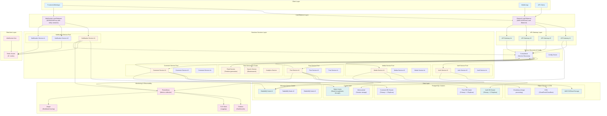

```mermaid
graph TB
    subgraph "Client Layer"
        FE["Frontend (Web/App)"]
        MA["Mobile App"]
        API["API Clients"]
    end
    
    subgraph "Load Balancer Layer"
        ELB["External Load Balancer<br/>(AWS ALB/Cloud Load Balancer)"]
        WS_LB["WebSocket Load Balancer<br/>(NGINX/HAProxy with sticky sessions)"]
    end
    
    subgraph "API Gateway Layer"
        APIGW1["API Gateway #1"]
        APIGW2["API Gateway #2"]
        APIGW3["API Gateway #3"]
        APIGWn["API Gateway #n"]
    end
    
    subgraph "Service Discovery & Config"
        CONSUL["Consul/etcd<br/>(Service Discovery)"]
        CONFIG["Config Server"]
    end
    
    subgraph "Business Services Layer"
        subgraph "Auth Service Pool"
            AUTH1["Auth Service #1"]
            AUTH2["Auth Service #2"]
            AUTHn["Auth Service #n"]
        end
        
        subgraph "Post Service Pool"
            POST1["Post Service #1"]
            POST2["Post Service #2"]
            POSTn["Post Service #n"]
        end
        
        subgraph "Comment Service Pool"
            COMMENT1["Comment Service #1"]
            COMMENT2["Comment Service #2"]
            COMMENTn["Comment Service #n"]
        end
        
        subgraph "Media Service Pool"
            MEDIA1["Media Service #1"]
            MEDIA2["Media Service #2"]
            MEDIAn["Media Service #n"]
        end
        
        subgraph "Notification Service Pool"
            NOTI1["Notification Service #1"]
            NOTI2["Notification Service #2"]
            NOTIn["Notification Service #n"]
        end
        
        subgraph "New Services for Scale"
            SEARCH["Search Service<br/>(Elasticsearch)"]
            FEED["Feed Service<br/>(Timeline generation)"]
            ANALYTICS["Analytics Service"]
        end
    end
    
    subgraph "Real-time Layer"
        REDIS_CLUSTER["Redis Cluster<br/>(6+ nodes)"]
        WS_HUB["WebSocket Hub"]
    end
    
    subgraph "Data Layer"
        subgraph "PostgreSQL Clusters"
            PG_AUTH["Auth DB Cluster<br/>(Primary + 2 Replicas)"]
            PG_POST["Post DB Cluster<br/>(Primary + 2 Replicas)"]
            PG_COMMENT["Comment DB Cluster<br/>(Primary + 2 Replicas)"]
        end
        
        subgraph "Message Queue Cluster"
            RABBITMQ1["RabbitMQ Node #1"]
            RABBITMQ2["RabbitMQ Node #2"]
            RABBITMQ3["RabbitMQ Node #3"]
        end
        
        subgraph "Object Storage & CDN"
            S3["AWS S3/Cloud Storage"]
            CDN["CDN (CloudFront/Cloudflare)"]
            CLOUDINARY["Cloudinary (Image processing)"]
        end
        
        subgraph "Cache Layer"
            REDIS_CACHE["Redis Cache<br/>(Read-through/write-through)"]
            MEMCACHED["Memcached<br/>(Session storage)"]
        end
    end
    
    subgraph "Monitoring & Observability"
        PROMETHEUS["Prometheus<br/>(Metrics collection)"]
        GRAFANA["Grafana<br/>(Dashboards)"]
        ELK["ELK Stack<br/>(Logging)"]
        JAEGER["Jaeger<br/>(Distributed tracing)"]
    end
    
    %% Connections
    FE --> ELB
    MA --> ELB
    API --> ELB
    
    ELB --> APIGW1
    ELB --> APIGW2
    ELB --> APIGW3
    ELB --> APIGWn
    
    %% WebSocket traffic
    FE --> WS_LB
    WS_LB --> NOTI1
    WS_LB --> NOTI2
    WS_LB --> NOTIn
    
    %% API Gateway to Services
    APIGW1 --> CONSUL
    APIGW2 --> CONSUL
    APIGW3 --> CONSUL
    APIGWn --> CONSUL
    
    CONSUL --> AUTH1
    CONSUL --> POST1
    CONSUL --> COMMENT1
    CONSUL --> MEDIA1
    CONSUL --> SEARCH
    CONSUL --> FEED
    
    %% Service to Service Communication
    POST1 --> RABBITMQ1
    COMMENT1 --> RABBITMQ1
    NOTI1 --> RABBITMQ1
    
    %% Database Connections
    AUTH1 --> PG_AUTH
    POST1 --> PG_POST
    COMMENT1 --> PG_COMMENT
    
    %% Cache Connections
    POST1 --> REDIS_CACHE
    COMMENT1 --> REDIS_CACHE
    AUTH1 --> MEMCACHED
    
    %% Real-time Connections
    NOTI1 --> REDIS_CLUSTER
    NOTI2 --> REDIS_CLUSTER
    NOTIn --> REDIS_CLUSTER
    WS_HUB --> REDIS_CLUSTER
    
    %% Media Storage
    MEDIA1 --> S3
    MEDIA1 --> CDN
    MEDIA1 --> CLOUDINARY
    
    %% Monitoring
    APIGW1 --> PROMETHEUS
    POST1 --> PROMETHEUS
    NOTI1 --> PROMETHEUS
    
    PROMETHEUS --> GRAFANA
    PROMETHEUS --> ELK
    PROMETHEUS --> JAEGER
    
    %% Internal Load Balancing
    POST1 --> CONSUL
    COMMENT1 --> CONSUL
    NOTI1 --> CONSUL
    
    %% Styling
    classDef client fill:#e1f5fe
    classDef lb fill:#f3e5f5
    classDef gateway fill:#e8f5e8
    classDef service fill:#fff3e0
    classDef realtime fill:#ffebee
    classDef data fill:#e0f2f1
    classDef monitoring fill:#fce4ec
    
    class FE,MA,API client
    class ELB,WS_LB lb
    class APIGW1,APIGW2,APIGW3,APIGWn gateway
    class AUTH1,POST1,COMMENT1,MEDIA1,NOTI1,SEARCH,FEED,ANALYTICS service
    class REDIS_CLUSTER,WS_HUB realtime
    class PG_AUTH,RABBITMQ1,S3,REDIS_CACHE data
    class PROMETHEUS,GRAFANA,ELK,JAEGER monitoring
```